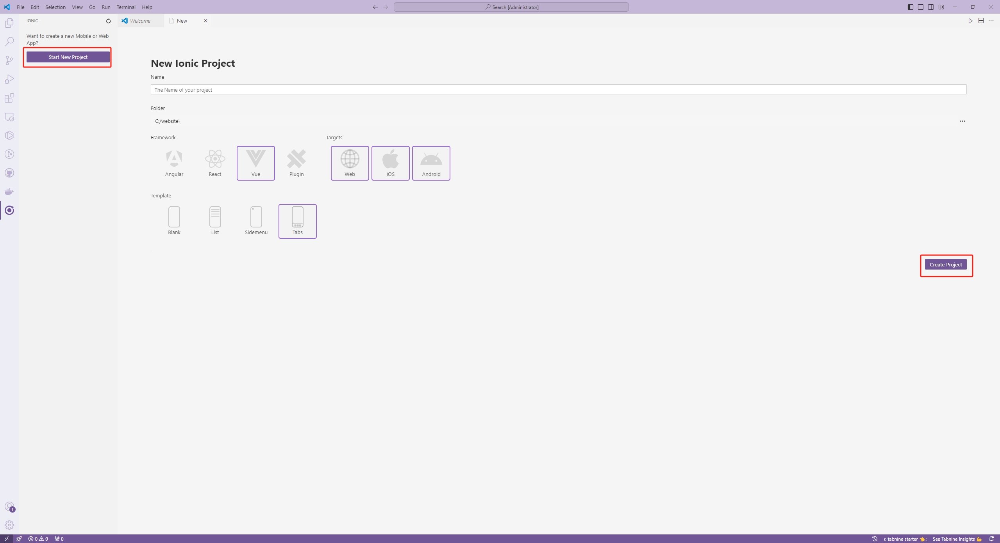
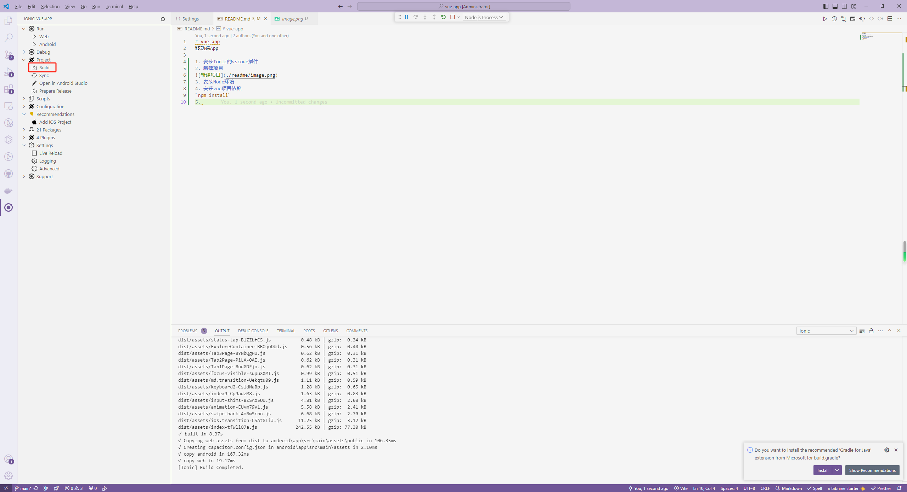
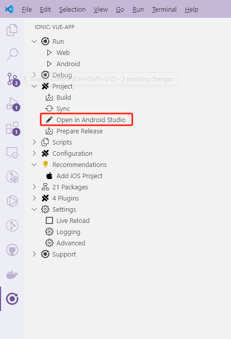
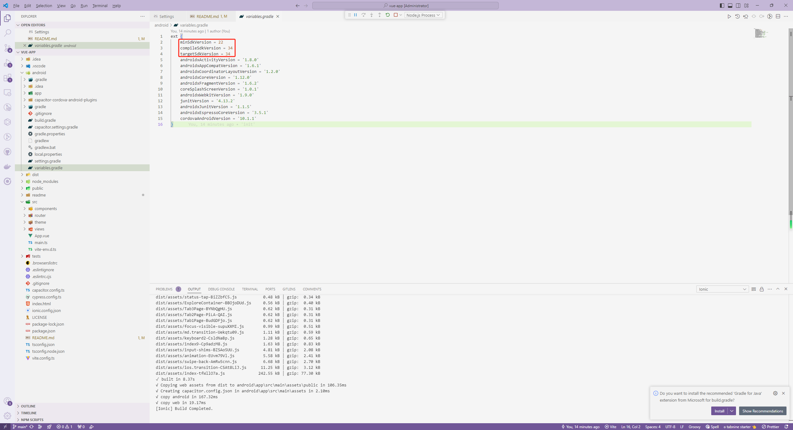
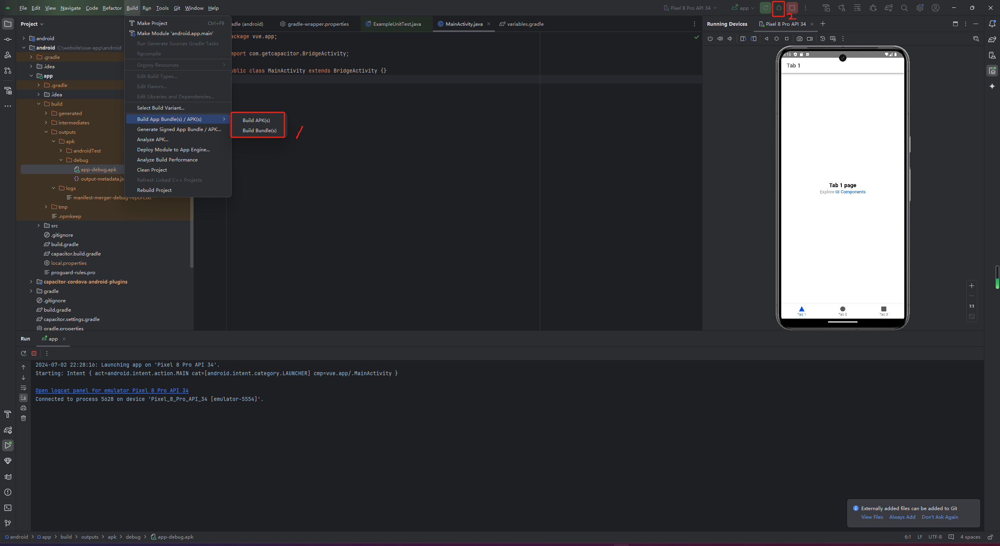

# vue-app
移动端App

1. 安装Ionic的vscode插件

2. 新建项目



3. 安装Node环境

4. 安装vue项目依赖

`npm install`

5. 构建



6. 安装 Android Studio

7. 在Android Studio打开App



8. 需要注意软件打包的sdk版本与模拟器的sdk版本是否兼容，否则可能出现一直闪烁的情况



8.1 minSdkVersion (最低支持API级别)

定义：minSdkVersion 指定了能够运行该应用的最低Android API级别。例如，如果minSdkVersion设为22，意味着该应用只能在Android 5.1（Lollipop）及以上版本的设备上运行。
作用：通过设定minSdkVersion，开发者可以确保他们的应用不在一些旧版本Android系统上运行，这些旧版系统可能缺乏某些功能或无法提供所需的性能支持。同时，这也帮助开发者在开发过程中使用最新的API特性，而不用担心在不支持这些特性的旧设备上出现问题。
案例：假设开发者在应用中使用了Android 6.0（Marshmallow）引入的动态权限管理特性，那么最低支持版本至少应该是6.0。在这种情况下，将minSdkVersion设置为23或更高，可以确保所有使用该应用的设备都能正常处理这些新特性。

8.2 compileSdkVersion（编译SDK版本）

定义：compileSdkVersion 指用于编译应用源代码的Android SDK的版本。例如，如果compileSdkVersion设为34，意味着应用使用Android 10的SDK进行编译。
作用：通过设定一个较高的compileSdkVersion，开发者可以在开发过程中利用最新的API和工具，提高应用的性能和用户体验。但需要注意的是，这并不意味着应用只能在这个版本的Android系统上运行；它依然可以在符合minSdkVersion要求的较旧系统上运行。
案例：如果开发者在项目中使用了一些仅在Android 10中引入的API，那么需要将compileSdkVersion设为34（即Android 10），以确保这些API在编译时可用，同时也要确保代码能够在更低版本的Android系统上兼容运行。

8.3 targetSdkVersion（目标SDK版本）

定义：targetSdkVersion 指应用为目标用户的Android系统版本。如果设为34，意味着应用完全兼容并针对Android 10进行优化。
作用：设定targetSdkVersion有两个主要目的：一是告诉Android系统应用已经过针对该系统版本的测试和优化，确保在该版本上运行良好；二是允许系统对该应用采取相应的向前兼容策略。例如，当应用在一个新的Android系统版本上运行时，系统可能会采用新的UI风格或其他行为变更，如果应用的targetSdkVersion低于此版本，系统会尝试以老方式运行该应用，以免引入的新技术或变更影响其运行。
案例：假如开发者希望他们的应用充分利用Android 10的新特性，并且已经确保在这些特性上的兼容性和性能表现，那么可以将targetSdkVersion设为34。这样，当应用在Android 10设备上运行时，系统会默认应用已经支持所有Android 10的新行为和用户界面。

9. 打包为apk



9.1 准备工作

安装依赖：确保所有必要的依赖库已正确安装在项目中，这可以通过在项目的build.gradle文件中添加依赖并同步项目来实现。
配置应用信息：打开app/build.gradle文件，确保applicationId（包名）、versionCode（版本号）和versionName（版本名称）按需求进行配置。例如：

```groovy
android {
    defaultConfig {
        applicationId "com.example.myapp"
        versionCode 1
        versionName "1.0"
    }
}
```

9.2 生成Debug和Release包

9.2.1 生成调试包：在开发过程中，通常使用Debug模式构建APK进行调试和测试。这种模式下的APK包含丰富的调试信息，但无法直接分发给用户。要生成Debug版本的APK，只需在Android Studio中点击运行按钮即可。

9.2.2 生成Release包：

在Android Studio中，选择“Build” -> “Generate Signed Bundle / APK”。
如果尚未拥有密钥证书（Keystore），请选择“Create new...”，按照提示填写证书信息并设置密码。
选定密钥存储位置及相应密码后，进入下一步选择“release”构建类型。
完成以上步骤后，点击“Finish”生成Release版本的APK，此APK可以分发给用户并进行安装。

9.3 优化打包细节

9.3.1 自定义APK名称

为了避免混淆，通常会在生成APK时为其指定一个有意义的名称。修改app/build.gradle文件，加入以下代码：

```groovy
android.applicationVariants.all { variant ->
    variant.outputs.all {
        outputFileName = "MyAppName_${variant.versionCode}.apk"
    }
}
```

这样每次生成的APK名称都会包含应用名称和版本号。

9.3.2 增加版本和日期信息

为了更好的管理不同版本的APK，可以在命名中加入日期和时间信息，如下所示：

```groovy
outputFileName = "MyAppName_v${versionName}_${buildDate()}.apk"

def buildDate() {
    new Date().format('yyyyMMdd_HHmm')
}
```

这样可以方便地识别每个APK的具体构建时间和版本。

9.4 签名和验证

9.4.1 签名APK

如前所述，生成Release版本的APK时需要对其进行签名。这一步是为了确保应用的完整性和安全性。具体操作是在“Generate Signed Bundle / APK”向导中选择已有的Keystore或创建新的Keystore进行签名。

9.4.2 验证签名

签名完成后，可以使用APK签名验证工具（如jarsigner）来检查APK是否签名成功。在命令行中输入以下命令：

```bash
jarsigner -verify -verbose -certs MyAppName.apk
```

如果输出结果显示“verified”，则签名成功。

10. 发布和分发

10.1 上传到应用市场

将生成的Release版本APK上传到Google Play或其他Android应用市场。具体步骤依赖于所选择的应用市场，通常包括创建应用信息、上传APK文件、设置应用权限和发布范围等。

10.2 分发测试

在应用上线之前，可以使用如TestFlight之类的工具进行Beta测试。将APK分发给用户进行测试，并收集反馈进行最后的优化调整。
